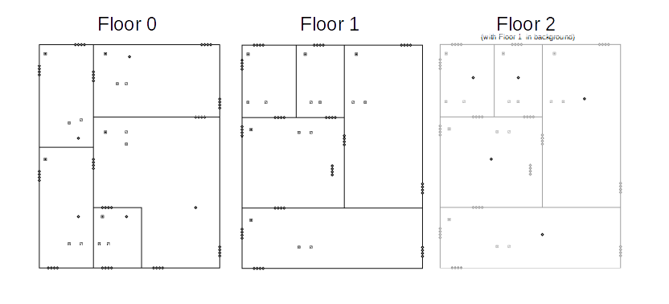
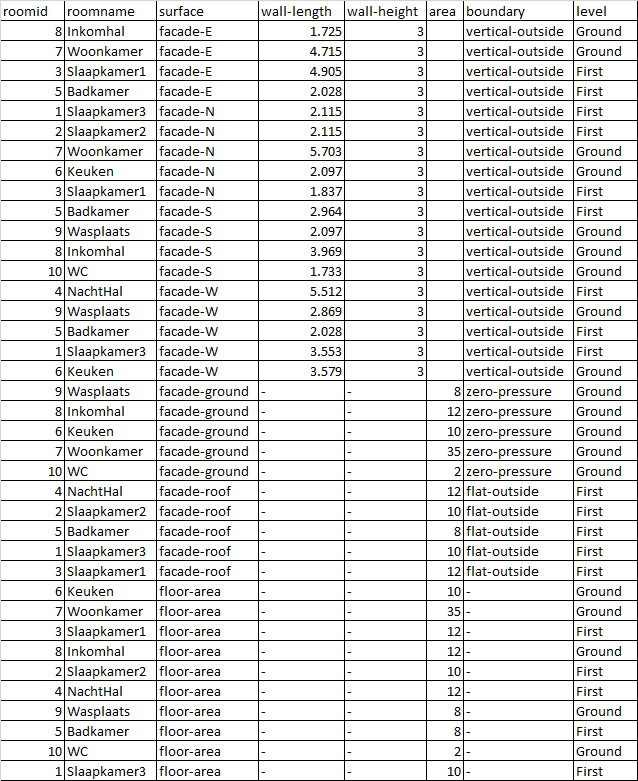

# ContamPy
Python scripts and tools to set up and run ***CONTAM*** models

The purpose of this library is to ease and speed-up the setup of CONTAM simulations through Python. The graphical user interface Contam***W*** is nice, but its use is quite time-consuming, especially for drawing control networks. Furthermore, doing parametric analyses is not straightforward through the GUI. 

## Driving principles in the development of ContamPy

+ The ContamW GUI has features than can hardly be replaced by Python scripts (without developing a new GUI)
	+ drawing the layout (floor plans) of the building
	+ putting flow paths at the right place, with the implicit definition of the flow paths azimuth
	+ visualize the direction of flow and pressure differences
+ All the rest is easier/faster to defined in scripts or files
+ The way to define flow elements or flow paths is not close enough to the ventilation field

## Quick start guide

### Drawing a ContamPy compatible building

[Example: 0_modelGeneration](examples/0_modelGeneration)


As ContamPy relies on a few default components, a new building should be drawed starting from the file: 

*examples\Ressources\RefBuildings\empty_model.prj*

This model contains one default AHS system and a few defaults elements. 

The requirements are

+ drawing one or more zones in the different floors (draw the zone,define the zone element and its name). No volume or dimensions are needed at this stage
+ flow paths at every place where you consider there could be a flow in your model:
	+ 4 parallel flow paths between adjacent zones (both through walls or through floors)
	+ 4 parallel flow paths at each wall in contact with the outside
	+ one flow path on the floor of zones in contact with the ground (or cellar that is not represented in the flow model)
	+ one flow path in the "roof" of each zone whose roof is exposed to outside (or ceiling in contact with an non-represented attic). 
	+ all these flow paths should be on the type "DefaultPath". 
+ one supply point and one return point in each zone

The purpose of all these paths will be explained further. If may seem quite complex, but this kind of model (with no numerical value to introduce) can be setup in a few minutes only. 


An example of such a model can be found in 

*examples\0_modelGeneration\DetachedHouse_noDimensions.prj*


 


### Initializing paths and set dimensions

#### What are the flow paths for ?

The 4 flow paths present in each internal/external wall will be used to represent:

+ One for a supply vent or window or intensive ventilation opening
+ Two for building envelope leaks (the leak in each wall is split in two flow paths at different heights so that there may be a leak flow rate induced by thermal effects)
+ One extra flow path currently not used (just in case more devices components would be needed, for example a natural supply vent and a window on the same facade)

The paths towards floor or roof can be used to represent leaks (if any). 


#### User input for model dimensions

Even though the model dimensions can implicitely be determined by ContamW using a scale, this feature is not used here. 

The dimensions of the model are defined using a CSV file. For the example above, the CSV file. An example corresponding to the previous floor plan is given below:



+ For any vertical wall, one can fill the length of the element and its height, or directly the area
+ For horizontal elements, the area has to be specified
+ All dimensions are assumed "exterior", excepted for the floor area which is supposed "interior" (net floor area)

***Why are all these data needed and why using an external CSV file?***

+ The floor areas are needed to compute the rooms internal volumes
+ The exterior wall/ceiling/floor area are used to compute the surface of each element, which will be used in the calculation of infiltrations (for example if the input parameter for airthightness is v50)
+ An external file (CSV here) is used for several reasons:
	+ Readability: it is easier for a person to read it in this format than to look in the Contam PRJ file
	+ Easy to change, for the same reasons
	+ Some of the data can be used as input to design a ventilation system in further steps (e.g. in the Belgian NBN D-50-001 standard the floor area is used to determine the design flow rate)


***How to to do it in practice ?***

The CSV file without dimensions is automatically generated from the Contam Prj file. The dimensions are then to be filled from the user

An example is given in the folder : *examples\0_modelGeneration\\*

The first step is the "check", i.e. veryfing that the input model has the correct number of flow paths. If yes, a CSV file with no dimensions is generated.

For this example, the following code can be found in the file *runCheck.py*
```
from checkContamPlan import checkContamPlan
inputPRJ = 'DetachedHouse_noDimensions.prj'
checkContamPlan(inputPRJ)
```

When the CSV file has been filled by the user, one can execute *runSet.py*. 
```
from setContamPlan import setContamPlan
inputPRJ = 'DetachedHouse_noDimensions.prj'
outputPRJ = 'DetachedHouse_withDimensions.prj'
# This CSV file has to be filled by hand by the user from the "empty" one
filledCSV = 'DetachedHouse_noDimensions-areas-filled.csv'
setContamPlan(inputPRJ,filledCSV,outputPRJ)
```

After this step, the output model will have the following properties:
+ the flow paths types (flow elements) will be changed
	+ there will be a generic "Natural Supply Vent" on each exterior wall, with a zero multiplier
	+ there will be 2 generic leaks for walls (1 for floor/ceiling) with whose leak flow rate is 1 m³/h for 50 Pa pressure differences
+ the two leaks of each wall will have a multiplier equilvalent to half of the element area
+ the single leak of each ceiling/floor has a multiplier equilvalent to the element area

Said otherwise, after this step, the global building v50 is 1 with leaks uniformly distributed on the "heat loss area". This can be changed later when setting up the model for a simulation. 


