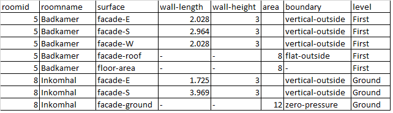

# Create a ContamPy compatible building

## Template PRJ file

As ContamPy relies on a few default components, a new building should be drawed starting from the file: 

*examples\Ressources\RefBuildings\empty_model.prj*

This is a Contam project file file with a few default flow elements and levels, but not building drawn yet.  

## Drawing the building in ContamW

The following operations must be done in ContamW starting from the template:

+ draw one or more zones in the different floors (draw the zone,define the zone element and its name). No volume or dimensions are needed at this stage
+ define flow paths at every place where you consider there could be a flow in your model:
	+ 4 parallel flow paths between adjacent zones (both through walls or through floors, for example between two halls)
	+ 4 parallel flow paths at each wall in contact with the outside
	+ one flow path on the floor of zones in contact with the ground (or cellar that is not represented in the flow model)
	+ one flow path in the roof/ceiling of each zone whose roof/ceiling is in contact with outside (or in contact with a non-represented attic). 
	+ the element should be on the type "DefaultPath" as air flow element
+ one supply point and one return point in each zone

The purpose of all these elements is explained in the next section. As only default elements are to be drawn, and no numerical value introduced, the drawing step is only a matter of a few minutes, as one can easily copy/paste flow paths with Ctrl+C and Ctrl+v.

An example of such a model can be found in 

*examples\0_modelGeneration\DetachedHouse_noDimensions.prj*

 


***What are all these flow paths for ?***

The 4 flow paths present in each internal/external wall will be used to represent:

+ One for a supply vent or window or intensive ventilation opening
+ Two for building envelope leaks (the leak in each wall is split in two flow paths at different heights so that there may be a leak flow rate induced by thermal effects)
+ One extra flow path currently not used (just in case more devices components would be needed, for example a natural supply vent and a window on the same facade)

The paths towards floor or roof can be used to represent leaks (if any). 


## Define zones floor and boundary areas in a CSV file

### Example and explanation of the CSV file

Even though the model dimensions can implicitely be determined by ContamW using a scale, this feature is not used here. 

The dimensions of the model are defined using a CSV file. An example corresponding to the previous floor plan is given below (only part of the file is displayed).



+ For any vertical wall, one can fill the length of the element and its height, or directly the area
+ For horizontal elements, the area has to be specified
+ All dimensions are assumed "exterior", excepted for the floor area which is supposed "interior" (net floor area)
+ A boundary type has to be specified for each wall, in order to select the proper wind pressure coefficient in further steps


### Why are all these data needed and why using an external CSV file?

+ The floor areas are needed to compute the rooms internal volumes
+ The exterior wall/ceiling/floor area are used to compute the surface of each element, which will be used in the calculation of infiltrations (for example if the input parameter for airthightness is v50)
+ An external file (CSV here) is used for several reasons:
	+ Readability: it is easier for a person to read it in this format than to look in the Contam PRJ file
	+ Easy to change, for the same reasons
	+ Some of the data can be used as input to design a ventilation system in further steps (e.g. in the Belgian NBN D-50-001 standard the floor area is used to determine the design flow rate, or boundary type to define pressure coefficients)


### How to to do it in practice ?

Two functions are needed to get from the initial drawing (with no dimensions) to the building model with the correct volume and default flow paths set:
+ *checkContamPlan*: it will check that the correct number of junctions are set and create the CSV file corresponding to the Contam prj file (without dimensions)
+ *setContamPlan*: it will read the CSV file (that has been filled by the user) and configure the prj file

After this step, the output model will have the following properties:
+ the flow paths types (flow elements) will be changed
	+ there will be a generic "Natural Supply Vent" on each exterior wall, with a zero multiplier
	+ there will be generic leaks for walls, floors and ceilings, whose leak flow rate is 1 m³/h for 50 Pa pressure differences (with exponent 0.66)
		+ the two leaks of each wall will have a multiplier equilvalent to half of the element area (two leaks at different heights to allow leak flow rate due to thermal draught)
		+ the single leak of each ceiling/floor has a multiplier equilvalent to the element area

Said otherwise, after this step, the building as a global v50 of 1, with leaks uniformly distributed over the extrnal enveloppe area. This can be changed later when setting up the model for a simulation. 

### Example

An example is given in the folder : [examples\0_modelGeneration](../examples/0_modelGeneration)


The following code can be found in the file *runCheck.py*
```
from checkContamPlan import checkContamPlan
inputPRJ = 'DetachedHouse_noDimensions.prj'
checkContamPlan(inputPRJ)
```

Aftre this step, the file *DetachedHouse_noDimensions-areas-empty.csv* is generated. It has to be filled by the user and renamed *DetachedHouse_noDimensions-areas-filled.csv*

When the CSV file has been filled by the user, one can execute *runSet.py*. 
```
from setContamPlan import setContamPlan
inputPRJ = 'DetachedHouse_noDimensions.prj'
outputPRJ = 'DetachedHouse_withDimensions.prj'
filledCSV = 'DetachedHouse_noDimensions-areas-filled.csv'
setContamPlan(inputPRJ,filledCSV,outputPRJ)
```

To run the full example, simply run *runAll.py*


